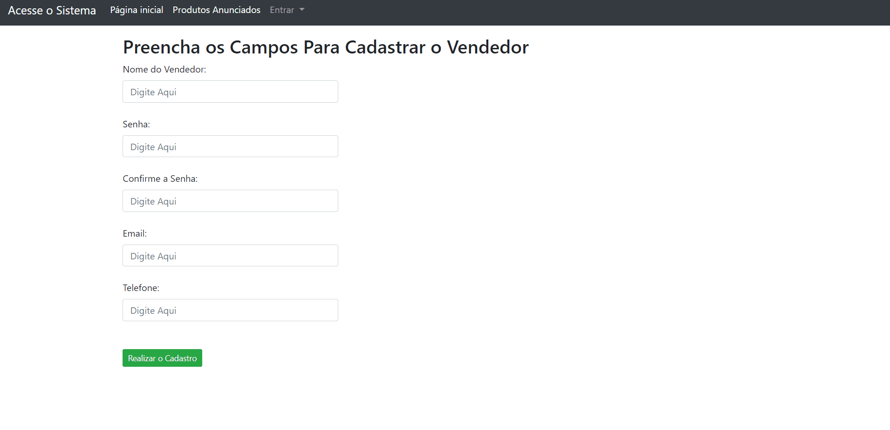
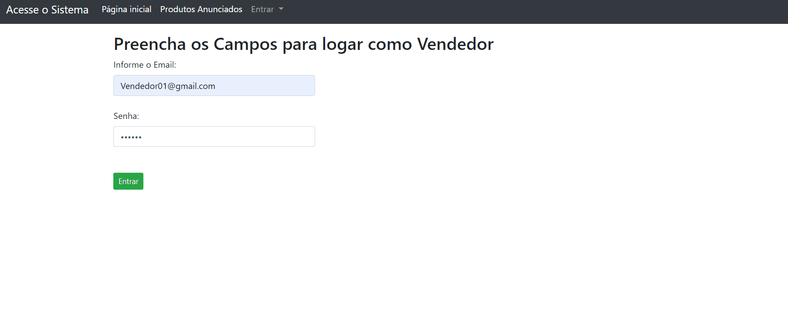

# Site De Anuncios

## Validações :

  

## Sistema de Login :

  

## Objetivo :
- Criar um site que tenha um sistema de Anuncios de produtos para compra de usuarios.
- Para Registrar um anuncio é necessario que o vendedor esteja logado no site, assim ele pode ver seus produtos já anunciados e anunciar algum novo.
- Usuarios podem ver todos os produtos anunciados, e podem clickar no botão de "Comprar" que os levará para uma pagina que simularia a compra do produto.

## Tecnologias :
- C#.
- Dapper - Banco de Dados.
- JavaScript.
- Bootstrap.
- Estruturado em Mvc.

## Como Executar :
- Crie um banco de Dados e pegue a ConnectionString dele.
- Insira a ConnectionString no *appsettings.json* no Projeto.Presentation.
- Insira as tabelas no banco de dados (codigo delas está dentro do arquivo "Banco_De_Dados".
- Compile e Execute.
